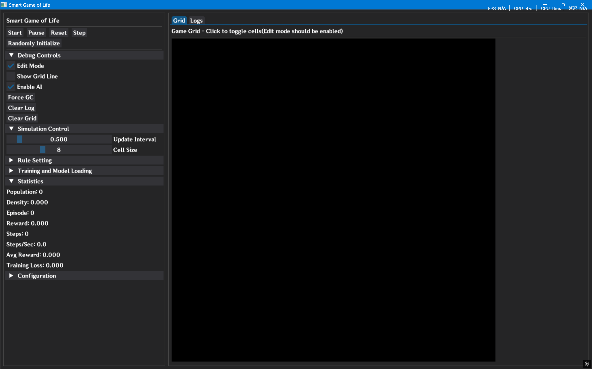

# ConwayLifegame++ 项目文档

## 项目概述

ConwayLifegame++ 是一个基于经典康威生命游戏的强化学习扩展项目。在传统生命游戏的基础上，项目引入了智能细胞概念，每个细胞都可以感知周围环境、自主移动，并通过强化学习算法优化其生存策略。
项目 GitHub 地址: [https://github.com/Joker-1212/ConwayLifegame](https://github.com/Joker-1212/ConwayLifegame)

### 核心特性

1. **增强的生命游戏规则**：

   - 细胞具有视野范围，可以感知周围环境
   - 细胞可以在 8 个方向上移动或选择不动
   - 细胞具有年龄和能量属性，影响生存概率
   - 引入细胞死亡概率和能量消耗机制

2. **混合架构设计**：

   - 使用 C++编写高性能游戏核心逻辑
   - 通过 PyBind11 将 C++核心暴露给 Python
   - 使用 PyTorch 实现深度 Q 学习算法
   - 使用 Dear PyGUI 构建图形用户界面

3. **强化学习集成**：
   - 每个细胞作为独立的智能体进行决策
   - 使用深度 Q 网络（DQN）学习最优移动策略
   - 支持经验回放和目标网络等高级技术
   - 可训练模型以最大化种群生存时间

## 项目架构

### 目录结构

```
ConwayLifegame++/
├── cpp_core/                    # C++核心库
│   ├── include/                # 头文件
│   │   ├── types.h            # 基础类型定义
│   │   ├── cell.h             # 细胞类定义
│   │   ├── config_parser.h    # 配置解析器
│   │   └── game_environment.h # 游戏环境接口
│   └── src/                   # 源文件
│       ├── cell.cpp           # 细胞实现
│       ├── config_parser.cpp  # 配置解析实现
│       └── game_environment.cpp # 游戏环境实现
├── python_bindings/           # Python绑定
│   ├── CMakeLists.txt        # 构建配置
│   └── pybind_wrapper.cpp    # PyBind11包装器
├── Module/                    # Python模块
│   ├── Agent/
│   │   └── cell_agent.py     # 细胞智能体
│   ├── Configs/
│   │   └── config.py         # 配置管理
│   ├── Environment/
│   │   └── game_env.py       # Python环境包装
│   ├── Models/
│   │   └── policy_network.py # 神经网络模型
│   └── Utils/
│       └── experience_replay.py # 经验回放缓冲区
├── Models/                    # 模型存储
│   ├── Models/               # 训练好的模型
│   └── Logs/                 # 训练日志
├── Font/                     # 字体文件
├── Release/                  # 构建输出
├── build.bat                 # Windows构建脚本
├── config.txt               # 游戏配置文件
├── GUI.py                   # 图形用户界面
├── train.py                 # 训练脚本
├── evaluate.py              # 评估脚本
├── test_windows.py          # 测试脚本
├── requirements.txt         # Python依赖
└── setup.py                 # 安装脚本
```

### 技术栈

- **核心语言**: C++ 17, Python 3.x
- **机器学习框架**: PyTorch
- **GUI 框架**: Dear PyGUI
- **绑定工具**: PyBind11
- **构建系统**: CMake
- **包管理**: Conda/Pip

## 安装与构建

### 环境要求

#### 跨平台支持

项目支持 Windows 和 Linux 平台，macOS 理论上也可编译但需要额外配置。

#### Python 环境

- Python 3.10+
- 推荐使用 Conda 或虚拟环境管理依赖

#### 系统依赖

**Windows:**

- MSVC 编译器 (Visual Studio 2022 Build Tools)

**Linux:**

- GCC/G++ 编译器 (g++ 9.0+)
- Python 开发包 (python3-dev)
- 必要的构建工具

#### Python 依赖

```bash
# 创建并激活环境
conda create -n conway
conda activate conway

# 安装Python依赖
conda install --yes --file ./requirements.txt
pip install dearpygui
```

### 构建步骤

#### Windows 自动构建

运行构建脚本：

```bash
.\build.bat
```

构建过程包括：

1. 检查依赖工具（CMake）
2. 构建 C++核心库（生成 smart_life_core.lib）
3. 构建 Python 绑定（生成 smart_life_core.pyd）
4. 复制生成的模块到项目根目录

#### Linux 自动构建

1. 给构建脚本添加执行权限：

```bash
chmod +x build.sh
```

2. 运行构建脚本：

```bash
./build.sh
```

构建过程包括：

1. 检查系统依赖（CMake、g++、Python 开发包）
2. 自动检测 pybind11 安装位置
3. 构建 C++核心库（生成 libsmart_life_core.a）
4. 构建 Python 绑定（生成 smart_life_core.so）
5. 复制生成的模块到项目根目录

#### 手动构建（高级用户）

1. **构建 C++核心库**:

**Windows:**

```bash
cd cpp_core
mkdir build && cd build
cmake .. -A x64
cmake --build . --config Release
```

**Linux:**

```bash
cd cpp_core
mkdir build && cd build
cmake .. -DCMAKE_BUILD_TYPE=Release
cmake --build .
```

2. **构建 Python 绑定**:

**Windows:**

```bash
cd python_bindings
mkdir build && cd build
cmake .. -A x64 -Dpybind11_DIR=%CONDA_PREFIX%\Lib\site-packages\pybind11\share\cmake\pybind11
cmake --build . --config Release
```

**Linux:**

```bash
cd python_bindings
mkdir build && cd build
cmake .. -DCMAKE_BUILD_TYPE=Release -DPython_ROOT_DIR=$(dirname $(dirname $(which python3)))
cmake --build .
```

### 验证安装

构建完成后，运行测试脚本验证安装：

```bash
python test_windows.py
```

或直接启动图形界面：

```bash
python GUI.py
```

### 故障排除

#### 常见构建问题

1. **CMake 找不到 Python**:

   - Windows: 确保 Python 已安装且添加到 PATH
   - Linux: 安装 python3-dev 包

2. **pybind11 找不到**:

   - 运行 `pip install pybind11`
   - 手动指定 pybind11 路径：`-Dpybind11_DIR=/path/to/pybind11/share/cmake/pybind11`

3. **导入错误**:

   - Windows: 确保 smart_life_core.pyd 在项目根目录
   - Linux: 确保 smart_life_core.so 在项目根目录
   - 设置 PYTHONPATH: `export PYTHONPATH=$PYTHONPATH:$(pwd)`

4. **链接错误**:
   - 确保 C++核心库已正确构建
   - 检查库文件路径是否正确

## 配置文件

项目使用`config.txt`文件配置游戏规则：

```ini
# Smart Game of Life Configuration
# Minimum number of neighbors for a cell to survive
LIVE_MIN = 2

# Maximum number of neighbors for a cell to survive
LIVE_MAX = 3

# Minimum number of neighbors for a cell to be born
BREED_MIN = 3

# Maximum number of neighbors for a cell to be born
BREED_MAX = 3

# Cell vision distance
VISION = 5

# Cell death probability
DEATH_RATE = 0.1

# Cell energy consume
ENERGY_CONSUMPTION = 0.1

# Cell energy restore rate
RESTORE_PROB = 0.1
RESTORE_VALUE = 0.2

# Grid size
ENV_WIDTH = 100
ENV_HEIGHT = 100
```

### 配置参数说明

| 参数               | 类型  | 描述                       | 默认值 |
| ------------------ | ----- | -------------------------- | ------ |
| LIVE_MIN           | int   | 细胞存活所需的最小邻居数   | 2      |
| LIVE_MAX           | int   | 细胞存活所需的最大邻居数   | 3      |
| BREED_MIN          | int   | 新细胞诞生所需的最小邻居数 | 3      |
| BREED_MAX          | int   | 新细胞诞生所需的最大邻居数 | 3      |
| VISION             | int   | 细胞的视野范围（半径）     | 5      |
| DEATH_RATE         | float | 基础死亡概率               | 0.1    |
| ENERGY_CONSUMPTION | float | 每次移动消耗的能量         | 0.1    |
| RESTORE_PROB       | float | 每回合能量恢复概率         | 0.1    |
| RESTORE_VALUE      | float | 每次恢复的能量值           | 0.2    |
| ENV_WIDTH          | int   | 网格宽度                   | 100    |
| ENV_HEIGHT         | int   | 网格高度                   | 100    |

## 使用方法

### 图形界面模式

运行图形用户界面：

```bash
python GUI.py
```

图形界面如下:


GUI 功能包括：

- **模拟控制**: 开始、暂停、重置、单步执行、随机初始化
- **编辑模式**: 手动添加/移除细胞
- **规则设置**: 实时修改游戏规则
- **训练控制**: 一键启动自动训练 (通过调用 train.py 脚本实现)
- **模型管理**: 加载/保存训练好的模型
- **统计显示**: 实时显示种群统计数据
- **环境设置**: 更改网格的大小和随机初始化的比例
- **模型载入**: 通过读取本地文件载入已训练好的模型

需要注意的是: 
1. 在游戏规则更改后, 原来的环境将被覆盖
2. 在自动训练完成后，需要手动导入已经训练好的模型

### 训练模式

启动训练脚本：

```bash
python train.py
```

训练参数配置（在`Module/Configs/config.py`中）：

- `MAX_EPISODES`: 最大训练回合数（默认：2000）
- `MAX_STEPS`: 每回合最大步数（默认：500）
- `LEARNING_RATE`: 学习率（默认：1e-3）
- `GAMMA`: 折扣因子（默认：0.99）
- `BATCH_SIZE`: 批大小（默认：64）
- `BUFFER_SIZE`: 经验回放缓冲区大小（默认：50000）

训练日志将存储在 ./Models/Logs 文件夹中
训练结果将存储在 ./Models/Models 文件夹中

### 评估模式

评估训练好的模型：

```bash
python evaluate.py .\Path\to\model.pth
```

## 强化学习算法

### 状态表示

每个细胞的状态是其视野范围内的网格状态：

- 状态维度：`(2 * VISION + 1)²`
- 每个位置：0（空）或 1（有细胞）
- 总状态空间：`(11)² = 121`（当 VISION=5 时）

### 动作空间

每个细胞有 9 个可能的动作：

- 0: 不动
- 1-8: 向 8 个方向移动（上、下、左、右、四个对角线）

### 奖励函数

奖励函数设计鼓励种群长期生存：

```python
def __calculate_reward(self, step):
    population = self.env.get_population()
    density = self.env.new_density()

    # 基础奖励：种群数量
    reward = population / (self.width * self.height)

    # 密度奖励：避免过度拥挤或过于稀疏
    if density 在合适范围内:
        reward += 0.1

    # 存活时间奖励
    reward += step * 0.002

    return reward
```

### 训练算法

使用深度 Q 学习（DQN）算法：

1. **经验回放**：存储转移`(s, a, r, s', done)`到缓冲区
2. **目标网络**：使用独立的目标网络计算目标 Q 值
3. **ε-贪婪策略**：平衡探索与利用
4. **双网络更新**：定期将策略网络参数复制到目标网络

## 项目亮点

### 性能优化

1. **C++核心**：游戏逻辑在 C++中实现，提供高性能模拟
2. **PyBind11 绑定**：高效的 C++/Python 接口，减少数据拷贝
3. **批量处理**：细胞状态和动作批量处理，提高效率

### 可扩展性

1. **模块化设计**：清晰的模块分离，便于维护和扩展
2. **配置驱动**：所有参数通过配置文件管理
3. **插件式架构**：易于添加新的规则或算法

### 用户体验

1. **直观的 GUI**：提供完整的可视化控制和实时反馈
2. **实时统计**：显示种群动态和训练进度
3. **交互式编辑**：支持手动编辑细胞布局
4. **自由编辑规则**：可以自由改变游戏规则

## 故障排除

### 常见问题

1. **构建失败**：

   - 确保安装了 Conda 并正确安装了所有依赖
   - 确保安装了 MSVC(for Windows) 构建工具或 GNU Tool Chain(for Linux)

2. **导入错误**：

   - 确保 `smart_life_core.pyd` 或 `smart_life_core.so` 在项目根目录
   - 检查 Python 环境是否正确激活
   - 验证依赖包是否安装完整

3. **训练不收敛**：
   - 调整学习率和折扣因子
   - 增加经验回放缓冲区大小
   - 修改奖励函数设计

### 调试建议

1. 启用 GUI 的调试日志
2. 使用`test_windows.py`验证核心功能

## 未来发展

### 计划功能

1. **多智能体协作**：细胞之间的通信与合作
2. **进化算法**：结合遗传算法优化神经网络结构
3. **优化训练**：优化训练流程使得在不同规则下有较好的训练成果和训练速度

### 研究方向

1. **迁移学习**：在不同环境大小和规则下的知识迁移
2. **分层强化学习**：细胞群体的分层决策
3. **多目标优化**：平衡种群数量、能量消耗和移动成本

## 代码规范

- C++代码遵循 Google C++风格指南
- Python 代码遵循 PEP 8 规范
- 使用有意义的变量和函数名
- 添加适当的注释和文档字符串

## 许可证

本项目基于 MIT 许可证开源。详见[LICENSE](LICENSE)文件。

## 致谢

- 感谢康威教授提出的经典生命游戏
- 感谢 PyTorch、PyBind11、Dear PyGUI 等开源项目

## 反馈

若有 Bug 或想要的新 feature，请在 [https://github.com/Joker-1212/ConwayLifegame/issues](https://github.com/Joker-1212/ConwayLifegame/issues) 中与我们分享或给我们提供 Pull Request！
